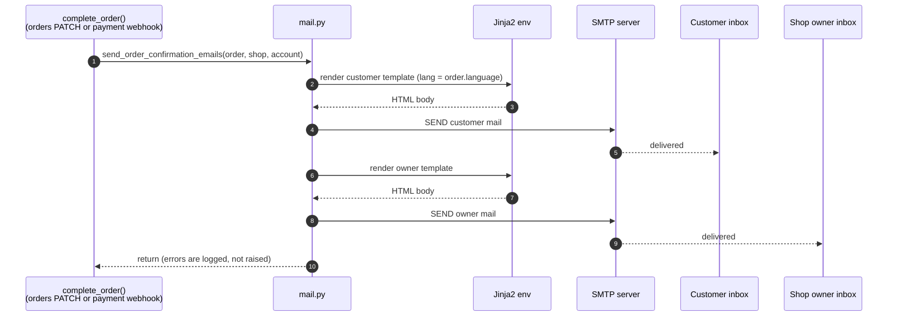

# Email notifications

Transactional email is rendered with Jinja2 and sent via SMTP.

## Implementation

- **Entry point:** `server/mail.py`.
- **Templates:** `server/mail_templates/{en,nl}/*.html.j2` — English and Dutch variants, each with a shared macros directory and image assets.
- **SMTP credentials:** `SMTP_HOST`, `SMTP_PORT`, `SMTP_USER`, `SMTP_PASSWORD`, `EMAILS_FROM_EMAIL` (see `server/settings.py`).

## Order confirmation flow

When an order transitions to "complete", `server/services/order_lifecycle.py` calls:

```python
send_order_confirmation_emails(order, shop, account)
```

There are two paths into that transition: the orders PATCH endpoint (admin / legacy frontend) and a paid [payment webhook or status sync](payments.md). Both funnel through the same idempotent `complete_order()` / `notify_order_complete()` service, so the mails are sent exactly once regardless of which path wins.

This renders and sends two mails:

1. **Customer confirmation** — `mail_order_confirmation_customer.html.j2`.
2. **Shop-owner notification** — `mail_order_confirmation_owner.html.j2`.



The call site wraps the send in try/except and logs failures rather than aborting the request — a delivery error must not undo a successful order completion.

## Price and VAT convention

`order_info[*].price` is **VAT-inclusive** — it matches the catalog price the customer sees in the shop. `_compute_order_lines_for_email` treats it as the ground truth and derives the ex-VAT figures by dividing out the applicable rate:

```
price_inc_btw     = item["price"]
price_ex_btw      = round(price_inc_btw / (1 + vat_rate/100), 2)
line_total_inc    = round(price_inc_btw * quantity, 2)
line_total_ex     = round(line_total_inc / (1 + vat_rate/100), 2)
```

The VAT rate comes from the product's `tax_category` (e.g. `vat_standard`, `vat_lower_1`), resolved against the shop's per-category rates (`shop.vat_standard`, `shop.vat_lower_1`, …). If the product has no `tax_category`, `shop.vat_standard` is used.

!!! warning
    Do **not** re-order this math to `price_ex = item["price"]; price_inc = price_ex * (1 + rate/100)`. That double-counts VAT — the displayed "Totaal inc BTW" would no longer match the amount the customer actually paid. See `test_compute_order_lines_treats_stored_price_as_vat_inclusive` in `tests/unit_tests/test_mail.py`.

## Local smoke-testing (Mailpit)

A disabled-by-default endpoint lets you exercise the full render + SMTP path against a local Mailpit instance without creating a real order.

- **Setting:** `MAIL_TEST_ENDPOINT_ENABLED` (in `MailSettings`, default `False`).
- **Route:** `POST /mail-test/send-order-confirmation` (mounted only when the flag is true).
- **Payload:** `{ "to": "customer@example.com", "shop_name": "ShopVirge Dev", "owner_email": "owner@example.com" }` — all fields optional.

The endpoint builds synthetic shop/order/account objects in memory and calls `send_order_confirmation_emails`, so no database rows are created.

!!! warning
    Never enable `MAIL_TEST_ENDPOINT_ENABLED` in production. The route is unauthenticated; anyone who can reach the backend can trigger outbound mail.

## Completion date timezone

`order.completed_at` is stored as a naive UTC timestamp (PostgreSQL `DateTime` column without `timezone=True`). For NL mails the renderer converts it to `Europe/Amsterdam` so the date shown to the customer matches their local clock; other languages currently render the UTC value as-is. Add new conversions in `send_order_confirmation_emails` when introducing another locale.

## Language selection

Template language is picked per order based on the order's language field, falling back to English when absent or unknown. New locales are added by creating `server/mail_templates/<lang>/` with the same file layout as `en/`.

## Adding a new transactional email

1. Create `server/mail_templates/<lang>/mail_<name>.html.j2` for each supported language (reuse macros from `server/mail_templates/<lang>/macros/`).
2. Add a sender function in `server/mail.py` that renders the template and calls the shared SMTP helper.
3. Call it from the endpoint that triggers the side effect. Wrap in try/except so a delivery failure does not propagate.
4. Unit-test it by asserting the render output (don't hit a live SMTP server in tests — see `tests/unit_tests/test_mail.py` for the pattern: monkeypatch `server.mail.SMTP` and assert on `send_message` calls).
