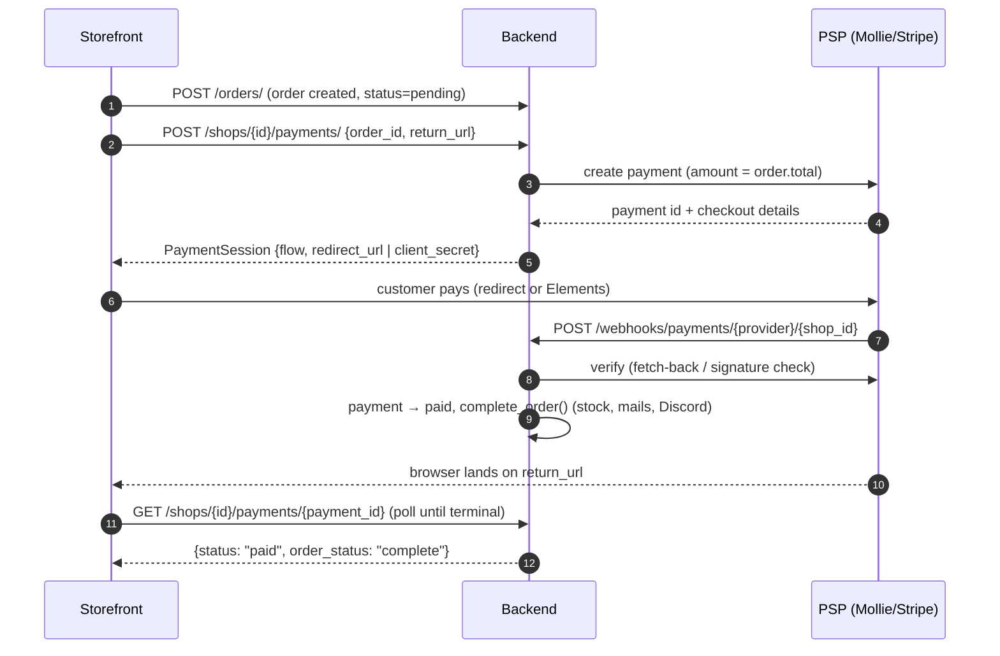

# Payments (provider-agnostic)

Checkout payments go through a pluggable provider layer: each shop selects a payment service provider (PSP) via `ShopTable.payment_provider`, and the frontend talks only to provider-agnostic endpoints. **Mollie** and **Stripe** are implemented; adding another PSP means implementing one class.

This supersedes the direct [Stripe endpoints](stripe.md) (`/shops/{shop_id}/stripe/*`), which remain in place for the legacy checkout but are deprecated for one-off payments.

## Design in one paragraph

A `PaymentProvider` turns a `(shop, order)` pair into a normalized `PaymentSession` that tells the frontend what to do next, and turns provider webhooks/polls into normalized `PaymentEvent`s. Payments are first-class rows in the `payments` table (an order can have several attempts — a failed iDEAL payment followed by a successful retry is two rows). Order completion is **owned by the backend**: a verified webhook (or the poll-time sync fallback) marks the payment `paid` and runs the idempotent `complete_order()` service. The frontend never marks an order complete.

## The files

| File | Role |
|------|------|
| `server/payments/base.py` | `PaymentProvider` ABC + `PaymentSession` / `PaymentEvent` / `PaymentStatus`. |
| `server/payments/registry.py` | `get_provider(shop)` — resolves `shop.payment_provider` to a provider instance. |
| `server/payments/mollie.py` | Mollie (hosted checkout, redirect flow). |
| `server/payments/stripe.py` | Stripe (PaymentIntents, in-page confirmation flow). |
| `server/payments/processing.py` | `apply_payment_event()` — the single funnel from provider events to payment/order state. |
| `server/services/order_lifecycle.py` | Idempotent `complete_order()` + the completion side effects (stock, Discord, emails, cache). |
| `server/api/endpoints/shop_endpoints/payments.py` | `POST` / `GET` payment endpoints. |
| `server/api/endpoints/webhooks.py` | Public `POST /webhooks/payments/{provider}/{shop_id}`. |
| `server/db/models.py` → `PaymentTable` | Payment attempts: provider, `provider_payment_id`, amount, status, raw PSP payload. |

## Endpoints

| Route | Auth | Purpose |
|-------|------|---------|
| `POST /shops/{shop_id}/payments/` | none (storefront) | Body `{order_id, return_url}`. Creates the payment at the shop's PSP and returns a `PaymentSession`. The amount is derived **server-side** from `order.total` — never from client input. Only `pending` orders are payable (`409` otherwise). |
| `GET /shops/{shop_id}/payments/{payment_id}` | none (storefront) | Status poll for the return page. Syncs from the PSP while the payment is non-terminal, so it doubles as the **webhook fallback** (local dev, missed/late webhooks). Returns `{status, order_status, ...}`. |
| `POST /webhooks/payments/{provider}/{shop_id}` | none (PSPs call it) | Verifies the event per provider, persists the status, and completes the order on `paid`. |

### The `PaymentSession` response

```json
{
  "payment_id": "…",
  "order_id": "…",
  "provider": "mollie",
  "status": "pending",
  "amount": 12.5,
  "currency": "EUR",
  "flow": "redirect",
  "redirect_url": "https://www.mollie.com/checkout/…",
  "client_secret": null,
  "publishable_key": null
}
```

`flow` is the only thing the frontend branches on:

- **`redirect`** (Mollie) — send the browser to `redirect_url`. No SDK, no keys.
- **`client_confirmation`** (Stripe) — confirm in-page with Stripe Elements using `client_secret` + `publishable_key`.

## Checkout flow



The poll in the last step also *syncs* status from the PSP, so the flow completes even when the webhook hasn't arrived (yet).

## Payment status lifecycle

`created → pending → paid | failed | canceled | expired`

Provider-native statuses are mapped onto this in each provider module (`MOLLIE_STATUS_MAP`, `STRIPE_INTENT_STATUS_MAP`). Terminal states stop the poll-time sync. A failed/canceled/expired attempt does not block checkout — the frontend can create a fresh payment for the same order.

## Webhook verification

Both webhook routes are deliberately unauthenticated; safety comes from provider-specific verification:

- **Mollie** sends unsigned webhooks containing only a payment id. Verification = fetching that payment back from the Mollie API with the shop's key and trusting **only** the API response — never the webhook body.
- **Stripe** events must carry a valid `Stripe-Signature`, checked against `payment_config["stripe"]["webhook_secret"]`. Without a configured secret the webhook is rejected.

`complete_order()` is idempotent, so PSP webhook retries — and a racing legacy frontend status PATCH — are harmless: whichever arrives second is a no-op.

## Per-shop configuration

| Column | Meaning |
|--------|---------|
| `shops.payment_provider` | `"stripe"` (default) or `"mollie"`. |
| `shops.payment_config` | JSONB, keyed by provider id. |

```json
{
  "mollie": {"api_key": "live_…"},
  "stripe": {"webhook_secret": "whsec_…"}
}
```

The Stripe provider keeps reading the legacy `stripe_secret_key` / `stripe_public_key` columns, so existing shops work without any migration. Switching a shop to Mollie is a data change, not a deploy:

```sql
UPDATE shops
SET payment_provider = 'mollie',
    payment_config = '{"mollie": {"api_key": "live_…"}}'
WHERE id = '…';
```

## Local development with Mollie

Mollie refuses non-public webhook URLs, so when `PUBLIC_BASE_URL` points at `localhost` the `webhookUrl` is omitted from payment creation and statuses move via the poll-time sync instead. To exercise real webhooks locally, expose the dev server (e.g. ngrok) and set `PUBLIC_BASE_URL` accordingly. Use a Mollie **test** API key (`test_…`) on the shop; Mollie's test mode lets you pick the outcome (paid/failed/expired) on the hosted checkout page.

## Adding a provider

1. Implement `PaymentProvider` (three methods: `create_payment`, `handle_webhook`, `get_status`) in `server/payments/<name>.py`, mapping native statuses to `PaymentStatus`.
2. Register an instance in `PROVIDERS` in `server/payments/registry.py`.
3. Document the expected `payment_config["<name>"]` keys.
4. Fake the PSP client at its seam in `tests/unit_tests/api/test_payments.py` (the Mollie tests are the template — they fake `MollieProvider._get_client` with real SDK objects).

## What stays Stripe-only (for now)

- **Subscriptions** — `/shops/{shop_id}/stripe/subscription*` is untouched; Mollie's recurring model (first payment + merchant-initiated charges) is a different shape and deliberately out of scope.
- **Stripe customer auto-creation** during order creation (`orders.py`) — harmless for Mollie shops (it only runs when a Stripe key is configured).
