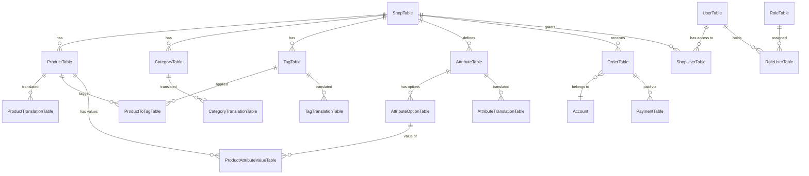

# Database & models

All SQLAlchemy models live in `server/db/models.py` and inherit from `BaseModel` (defined in `server/db/database.py`). Class names are suffixed with `Table`.

## Engine and session

`server/db/database.py` configures:

- **Engine** — PostgreSQL, 10 s connect timeout, UTC timezone, pool size 60, `python-rapidjson` for JSON (de)serialization.
- **`WrappedSession`** — a thin wrapper over `sqlalchemy.orm.Session` with `autocommit=False` and `autoflush=True`. Scoped via `ContextVar` so an async task sees its own session rather than a shared thread-local.
- **`BaseModel`** — a declarative base with:
    - a class-level `query` property (backed by `BaseModelMeta`),
    - a `__json__()` serializer that respects include/exclude lists and safely skips unloaded relationships or expired attributes.
- **`@transactional` decorator / `transactional(db, logger)` context manager** — runs a block atomically; commits on success, rolls back on exception.
- **`DBSessionMiddleware`** — opens a session at the start of each request, commits or rolls back at the end, closes and unbinds it.

## Core tables

The main tables and what they hold:

| Table | Purpose |
|-------|---------|
| `UserTable` | Authenticated users (email, username, password hash). |
| `RoleTable` / `RoleUserTable` | Role definitions and user ↔ role links. |
| `ShopTable` | Shops: name, config, payment provider + config, Stripe keys, VAT rates, webhooks. |
| `ShopUserTable` | User ↔ shop links. |
| `ProductTable` | Products: price, tax category, stock, image URLs 1–6, featured/new flags, optional recurring pricing. |
| `ProductTranslationTable` | Per-language product name and description. |
| `CategoryTable` | Product categories with colour, icon, order number, images. |
| `CategoryTranslationTable` | Per-language category name and description. |
| `TagTable` / `TagTranslationTable` / `ProductToTagTable` | Product tags and their join table. |
| `AttributeTable` / `AttributeTranslationTable` | Attributes such as "size" or "colour". |
| `AttributeOptionTable` | Values of an attribute (e.g. "Small", "Red"). |
| `ProductAttributeValueTable` | Product-specific attribute assignments. |
| `OrderTable` | Orders: customer order id, order info JSON, status, completion tracking. |
| `PaymentTable` | Payment attempts at a PSP: provider, provider payment id, amount, normalized status, raw payload (see [Payments](../api/payments.md)). |
| `Account` | Shop customer/vendor accounts (`hash_name` supports anonymisation). |
| `License` | Recurring licence records. |
| `EarlyAccessTable` | Early-access sign-ups. |

## High-level ER sketch

The diagram is illustrative — consult `server/db/models.py` for exact column definitions, nullability, and cascade rules.

## Translation tables

Four tables have companion translation tables:

- `ProductTable` ↔ `ProductTranslationTable`
- `CategoryTable` ↔ `CategoryTranslationTable`
- `TagTable` ↔ `TagTranslationTable`
- `AttributeTable` ↔ `AttributeTranslationTable`

`CRUDBase` understands these relationships and transparently creates or updates translation rows when writing the parent. You rarely need to call them directly.

## Where to read more

- `server/db/models.py` — all tables and relationships.
- `server/db/database.py` — session/engine setup and the `BaseModel` helpers.
- `server/crud/base.py` — generic read/create/update/delete helpers with shop-scoping and translation handling.
- [Migrations](migrations.md) — how schema and data migrations flow through two parallel alembic branches.
